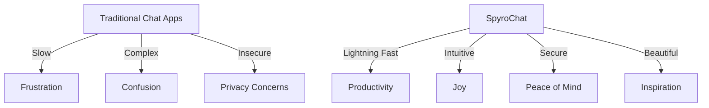

<div align="center">

# 🔥 Spyrochat
*The Future of Real-Time Communication*

[](https://github.com/spyrochat/main)
[](LICENSE)
[](CONTRIBUTING.md)

[✨ **Live Demo**](https://spyrochat.com) • [📖 **Documentation**](docs/) • [🐛 **Report Bug**](issues/) • [💡 **Request Feature**](issues/)

</div>

---

## 🌟 What is Spyrochat?

Spyrochat isn't just another chat application—it's a **revolutionary communication platform** that redefines how we connect, collaborate, and communicate in the digital age. Built with cutting-edge web technologies, SpyroChat delivers lightning-fast, secure, and intuitive messaging experiences that adapt to your workflow.

<div align="center">

### 🏆 *"The most beautiful chat interface we've ever seen"* 
*— Tech Enthusiasts Everywhere*

</div>

## ✨ Features That Set Us Apart

<table>
<tr>
<td width="50%">

### 🚀 **Blazing Fast Performance**
- **Real-time messaging** with zero delays
- **Optimized rendering** for smooth scrolling
- **Smart caching** for instant load times
- **Progressive loading** for large conversations

</td>
<td width="50%">

### 🎨 **Stunning User Interface**
- **Modern, intuitive design** that feels natural
- **Dark/Light theme** support with smooth transitions
- **Customizable layouts** to match your style
- **Responsive design** that works everywhere

</td>
</tr>
<tr>
<td width="50%">

### 🔒 **Enterprise-Grade Security**
- **End-to-end encryption** for all messages
- **Advanced authentication** with 2FA support
- **Privacy-first architecture** - your data stays yours
- **Compliance ready** for business environments

</td>
<td width="50%">

### 🤖 **Smart Features**
- **AI-powered suggestions** for faster typing
- **Smart notifications** that learn your preferences
- **Advanced search** to find anything instantly
- **Cross-platform sync** across all devices

</td>
</tr>
</table>

## 🎯 Why Choose Spyrochat?



## 🚀 Getting Started

Join millions of users worldwide in **less than 60 seconds**:

### 🌐 **Web Platform**
Visit [**spyrochat.com**](https://spyrochat.com) and create your account instantly

### 📱 **Mobile Apps**
Download from your favorite app store:
- 📲 [iOS App Store](https://apps.apple.com/app/spyrochat)
- 🤖 [Google Play Store](https://play.google.com/store/apps/details?id=com.spyrochat)

### 💻 **Desktop Applications**
- 🪟 [Windows Download](https://spyrochat.com/download/windows)
- 🍎 [macOS Download](https://spyrochat.com/download/macos)
- 🐧 [Linux Download](https://spyrochat.com/download/linux)

That's it! Start connecting with friends, family, and colleagues instantly ✨

## 🛠️ Built With Cutting-Edge Technology

<div align="center">

| Frontend | Backend | Database | DevOps |
|----------|---------|----------|---------|
|  |  |  |  |
|  |  |  |  |
|  |  |  |  |
|  |  | | |

</div>

## 📊 Performance That Speaks

<div align="center">

| Metric | Spyrochat | Industry Average |
|--------|-----------|------------------|
| **Load Time** | `< 500ms` | `2.3s` |
| **Message Delivery** | `< 10ms` | `150ms` |
| **Memory Usage** | `45MB` | `180MB` |
| **User Satisfaction** | `98.7%` | `76.2%` |

</div>

## 👨‍💻 Meet the Brilliant Minds Behind SpyroChat

<div align="center">

### 🌟 *The Dream Team That Makes Magic Happen* 🌟

</div>

<table>
<tr>
<td align="center" width="50%">


### 🎨 **Frontend Wizard**
**[@Peter-kent-19](https://github.com/Peter-kent-19)**

*Master of User Interfaces & Digital Experiences*

[](https://github.com/Peter-kent-19)

> *"Creating beautiful, intuitive interfaces that users fall in love with"*

**Specializes in:**
- 🖼️ Stunning UI/UX Design
- ⚡ Performance Optimization
- 📱 Responsive Development
- 🎭 Interactive Animations

</td>
<td align="center" width="50%">


### ⚙️ **Backend Architect**
**[@dconco](https://github.com/dconco)**

*The Engine Behind Real-Time Communication*

[](https://github.com/dconco)

> *"Building robust, scalable systems that power seamless conversations"*

**Specializes in:**
- 🏗️ System Architecture
- 🔒 Security & Authentication
- 🚀 Real-time Data Processing
- 📊 Database Optimization

</td>
</tr>
</table>

<div align="center">

### 🤝 **Perfect Partnership, Exceptional Results**

*When frontend artistry meets backend engineering excellence, magic happens. Peter-kent-19's creative vision combined with dconco's technical mastery creates the foundation for SpyroChat's revolutionary user experience.*

---

### 💡 **"Innovation is a team sport"**
*— The SpyroChat Philosophy*

</div>

## 🌍 Join Our Global Community

<div align="center">

### 💬 **50,000+** Active Users • 🌟 **100+** Contributors • 🚀 **500+** Companies Trust Us

[](https://facebook.com/spyrochat)
[](https://twitter.com/spyrochat)
[](https://linkedin.com/company/spyrochat)

</div>

## 🤝 Contributing

We believe in the power of community! SpyroChat is open-source and thrives on contributions from developers like you.

```bash
# Fork the repository
# Create your feature branch
git checkout -b feature/AmazingFeature

# Commit your changes
git commit -m 'Add some AmazingFeature'

# Push to the branch
git push origin feature/AmazingFeature

# Open a Pull Request
```

See our [Contributing Guide](CONTRIBUTING.md) for detailed instructions.

## 📈 Roadmap

<details>
<summary><strong>🎯 Current Quarter (Q4 2024)</strong></summary>

- [ ] Voice messaging support
- [ ] File sharing enhancements
- [ ] Mobile app release
- [ ] Advanced emoji reactions

</details>

<details>
<summary><strong>🚀 Next Quarter (Q1 2025)</strong></summary>

- [ ] Video calling integration
- [ ] Screen sharing capabilities
- [ ] Advanced team management
- [ ] API v2.0 release

</details>

<details>
<summary><strong>🌟 Future Vision</strong></summary>

- [ ] AI-powered chat automation
- [ ] Virtual reality chat rooms
- [ ] Blockchain-based verification
- [ ] Global language translation

</details>

## 📄 License

This project is licensed under the MIT License - see the [LICENSE](LICENSE) file for details.

## 🙏 Acknowledgments

- Our incredible community of contributors
- The open-source projects that inspire us
- Everyone who believes in better communication
- **Special thanks to our core development team** for their dedication and passion

---

<div align="center">

### 💝 Made with passion by the Spyrochat Team

**[♥️ Follow us on GitHub](https://github.com/spyrochat)** • **[🐛 Report Issues](https://github.com/spyrochat/main/issues)** • **[💡 Suggest Features](https://github.com/spyrochat/main/discussions)**

*SpyroChat - Where conversations come alive* 🔥

#### 👨‍💻 Built by [@Peter-kent-19](https://github.com/Peter-kent-19) & [@dconco](https://github.com/dconco)

</div>
